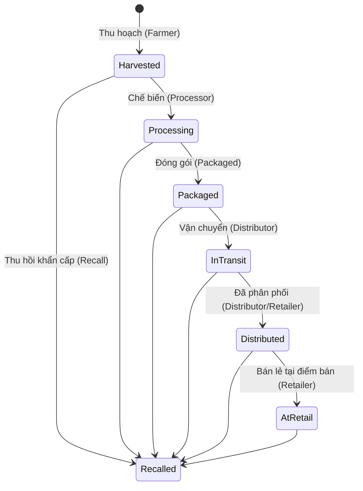

# 🌾 Tài Liệu Nghiệp Vụ Quản Lý Lô Hàng (Batch Management Business Specification)

> **Hệ thống Truy xuất Nguồn gốc Nông sản AgriTrace**  
> **Phiên bản:** 1.2  
> **Cập nhật gần nhất:** 03/08/2026  

---

## 📋 1. Tổng Quan Về Lô Hàng (Batch Management Overview)

Trong hệ thống **AgriTrace**, **Lô hàng (Batch)** đóng vai trò là **Aggregate Root trung tâm** đại diện cho một lượng sản phẩm nông sản cụ thể được gieo trồng, thu hoạch hoặc chế biến trong cùng một khoảng thời gian và tại cùng một cơ sở/nông trại.

Mọi hoạt động lưu vết trong chuỗi cung ứng (từ thu hoạch, vận chuyển, chế biến, đóng gói, kiểm định chất lượng đến phân phối và bán lẻ) đều xoay quanh và gắn liền với một mã Lô hàng duy nhất.

---

## 🔄 2. Cấu Trúc Thực Thể & Vòng Đời Lô Hàng (Batch Entity & Lifecycle)

### 2.1 Các thuộc tính cốt lõi của Lô Hàng (`Batch`)

| Thuộc tính | Kiểu dữ liệu | Mô tả nghiệp vụ |
| :--- | :--- | :--- |
| **`Id`** | `Guid` | Mã định danh hệ thống (Primary Key). |
| **`BatchCode`** | `String` | Mã lô hàng chuẩn chuẩn hóa (VD: `BAT-20260803-8A2F`). |
| **`ProductId`** | `Guid` | Loại sản phẩm nông sản (liên kết bảng `Products`). |
| **`Quantity`** | `Decimal` | Số lượng ban đầu khi tạo lô hàng. |
| **`RemainingQuantity`** | `Decimal` | Số lượng còn lại sau các lần Tách lô (Split). |
| **`UnitId` / `Unit`** | `Guid` / `String` | Đơn vị tính (VD: `kg`, `Tấn`, `Gram`, `Thùng`, `Bao`, `Sọt`, `Lít`). |
| **`Weight`** | `String` | Khối lượng chi tiết hiển thị. |
| **`HarvestDate`** | `DateOnly` / `DateTime` | Ngày thu hoạch / Sản xuất ban đầu. |
| **`Location`** | `String` | Địa chỉ hành chính nơi diễn ra hoạt động thu hoạch/nông trại. |
| **`GpsLocation` / `GPS`** | `String` | Tọa độ GPS địa lý (Vĩ độ, Kinh độ - VD: `11.9404, 108.4583`). |
| **`Status`** | `Enum` | Trạng thái hiện tại của lô hàng trong chuỗi cung ứng. |
| **`QrCodeUrl`** | `String` | Đường dẫn/dữ liệu mã QR Code phục vụ tra cứu công khai. |

---

### 2.2 Sơ đồ Chuyển đổi Trạng thái Lô Hàng (Batch Status Lifecycle)



#### Giải thích trạng thái:
1. **`Harvested` (Đã thu hoạch):** Lô hàng mới được tạo tại nông trại.
2. **`Processing` (Đang chế biến):** Lô hàng được tiếp nhận tại cơ sở chế biến.
3. **`Packaged` (Đã đóng gói):** Đã hoàn tất bao gói, dán tem nhãn.
4. **`In Transit` (Đang vận chuyển):** Đang trên đường giao cho nhà phân phối/điểm bán.
5. **`Distributed` (Đã phân phối):** Đã cập kho phân phối thành công.
6. **`At Retail` (Bán lẻ):** Đã có mặt tại siêu thị/điểm bán lẻ sẵn sàng đến tay người tiêu dùng.
7. **`Recalled` (Đã thu hồi):** Lô hàng bị cảnh báo vi phạm chất lượng/an toàn thực phẩm và bị phong tỏa.

---

## 🔒 3. Phân Quyền Hạn Ngạch & Quyền Truy Cập (RBAC & Authorization)

### 3.1 Quy định quyền truy cập tab "Batch Management"

Dựa trên yêu cầu nghiệp vụ về bảo mật dữ liệu và phân tách trách nhiệm trong chuỗi cung ứng:

- **Chỉ có 2 nhóm người dùng sau đây mới có quyền hiển thị Tab & Truy cập trang quản lý lô hàng (`/app/batches`):**
  1. **`ADMIN` (Quản trị viên hệ thống):** Toàn quyền kiểm soát, xem, chỉnh sửa, xóa và truy vết tất cả các lô hàng trên toàn hệ thống.
  2. **`FARM` (Chủ nông trại / Nông dân - Farmer):** Quyền tạo mới lô hàng thu hoạch ban đầu, quản lý thông tin các lô hàng do chính nông trại mình sản xuất.

- **Các tổ chức khác trong chuỗi (Processor, Distributor, Retailer, Inspector):**
  - Không truy cập trang khởi tạo Lô hàng ban đầu.
  - Tác nghiệp thông qua trang **Supply Chain Event Requests** (Gửi yêu cầu ghi nhận sự kiện Chế biến, Đóng gói, Vận chuyển, Phân phối) hoặc trang **Quality Inspection** (Kiểm định).

---

## 📍 4. Nghiệp Vụ Tạo Mới Lô Hàng (Create New Batch)

Khi một lô nông sản được thu hoạch, Nông dân (Farmer) hoặc Admin thực hiện khởi tạo lô hàng mới với các quy tắc sau:

### 4.1 Chọn Đơn Vị Tính (`UnitSelect`)
- Không nhập chuỗi tự do để tránh sai lệch dữ liệu.
- Người dùng chọn Đơn vị tính chuẩn hóa từ danh sách Hệ thống (VD: `Kilogram (kg)`, `Tấn (Ton)`, `Gram (g)`, `Thùng (Box)`, `Bao (Bag)`, `Sọt (Crate)`, `Lít (Liter)`).
- Đơn vị tính được ghi nhận đồng bộ vào cả `UnitId` và `UnitCode`.

### 4.2 Định vị trí Địa Lý & Bản đồ Tương tác (`Location Mapping`)
Để đảm bảo minh bạch vị trí thu hoạch:
1. **Chọn vị trí trên bản đồ (`Pick on Map`):** Mở cửa sổ Bản đồ tương tác 3rd-party (`MapPickerModal` Leaflet/OpenStreetMap). Người dùng có thể bấm trực tiếp lên bản đồ, kéo thả ghim vị trí hoặc tìm kiếm tên xã/huyện/tỉnh. Hệ thống tự động tính toán địa chỉ hành chính và tọa độ vĩ độ/kinh độ.
2. **Tự động định vị GPS (`Use Device GPS`):** Sử dụng cảm biến GPS của thiết bị (điện thoại/máy tính) để lấy tọa độ thực tế tại nông trại (`latitude, longitude`).
3. **Mở Google Maps (`View Google Maps`):** Hỗ trợ kiểm tra lại vị trí trên Google Maps qua đường dẫn vệ tinh.

### 4.3 Tự động Ghi Sổ Cái Băm (Hash Ledger Integration)
Ngay khi tạo lô hàng thành công:
- Hệ thống tự động phát sinh sự kiện **`HARVEST`** đầu tiên vào Sổ cái Append-Only.
- Khởi tạo mã băm đầu tiên: `PreviousHash = "0000000000000000000000000000000000000000000000000000000000000000"`.
- Tính toán `CurrentHash = SHA256(PreviousHash + EventData + Timestamp)`.

---

## 🔀 5. Nghiệp Vụ Tách & Gộp Lô Hàng (Batch Split & Merge)

Trong quá trình lưu thông qua các mắt xích, lô hàng có thể thay đổi hình thái qua 2 thao tác nghiệp vụ:

### 5.1 Tách Lô Hàng (`Batch Split`)
- **Ngữ cảnh:** Một lô nông sản thô 1,000 kg sau khi thu hoạch được tách thành 2 lô nhỏ (500 kg đóng hộp và 500 kg bán tươi).
- **Quy tắc:**
  - Lô gốc bị trừ `RemainingQuantity` tương ứng.
  - Tạo ra các Lô con mới (`Child Batches`) có tham chiếu `ParentBatchId = RootBatch.Id`.
  - Tự động ghi nhận sự kiện `SPLIT` vào chuỗi băm của lô gốc và các lô con.

### 5.2 Gộp Lô Hàng (`Batch Merge`)
- **Ngữ cảnh:** Gộp 3 lô nguyên liệu nhỏ từ 3 hộ nông dân thành 1 lô chế biến lớn tại nhà máy.
- **Quy tắc:**
  - Tạo ra Lô hàng đích mới (`Merged Target Batch`) với tổng số lượng bằng tổng các lô nguồn.
  - Lưu bảng liên kết phả hệ `BatchMergeSources` chứa danh sách tất cả các `SourceBatchId`.
  - Tự động ghi nhận sự kiện `MERGE` kết nối lịch sử truy xuất của các lô nguồn.

---

## ⛓️ 6. Toàn Vẹn Dữ Liệu & Chuỗi Băm SHA-256 (Hash Chain Integrity)

- Mỗi sự kiện tác động lên Lô hàng (Thu hoạch, Chế biến, Đóng gói, Vận chuyển, Phân phối, Kiểm định, Thu hồi, Tách, Gộp) đều là **Append-Only** (Chỉ được thêm mới, tuyệt đối không sửa/xóa).
- Sự kiện sau chứa mã băm `PreviousHash` của sự kiện trước đó.
- Nếu bất kỳ dữ liệu nào bị can thiệp trái phép trong CSDL, hàm kiểm tra `GET /api/v1/batches/{id}/events/verify` sẽ báo lỗi vi phạm tính toàn vẹn chuỗi.

---

## 📱 7. Truy Xuất Nguồn Gốc Công Khai Cho Người Tiêu Dùng (Consumer Traceability)

- Mỗi Lô hàng đi kèm 1 mã **QR Code** chứa đường dẫn công khai (VD: `https://agritrace.vn/trace/BAT-20260803-8A2F`).
- **Người tiêu dùng (Consumer)** quét mã QR không cần đăng nhập vẫn có thể xem:
  1. **Thông tin tổng quan nông sản:** Tên sản phẩm, Nông trại sản xuất, Ngày thu hoạch, Hình ảnh sản phẩm.
  2. **Vị trí địa lý:** Địa chỉ và tọa độ bản đồ nơi thu hoạch/chế biến.
  3. **Hành trình Dòng thời gian (Timeline):** Tất cả các mốc kiểm định, vận chuyển, đóng gói cùng trạng thái xác thực mã băm xanh (Verified Hash Chain).
  4. **Cảnh báo an toàn:** Hiển thị tức thời nếu lô hàng đang ở trạng thái Thu hồi (`Recalled`).

---

## 🛠️ 8. Tóm Tắt Luồng Xử Lý (Workflow Summary)

```
[ Farmer / Admin ]
       │
       ├── 1. Tạo Batch Mới ──► Chọn UnitSelect (kg, Tấn, Thùng...) ──► Location Mapping (MapPicker / GPS)
       │
       ├── 2. Tự động sinh SHA-256 Hash Chain (Event: HARVEST)
       │
       ├── 3. Tác nghiệp Tách / Gộp Lô (Split / Merge) nếu cần
       │
       └── 4. Sinh QR Code ──► Dán tem lên sản phẩm ──► Người tiêu dùng quét mã tra cứu công khai
```

---
*Tài liệu này được soạn thảo dựa trên chuẩn Clean Architecture & Domain-Driven Design (DDD) của hệ thống AgriTrace.*
