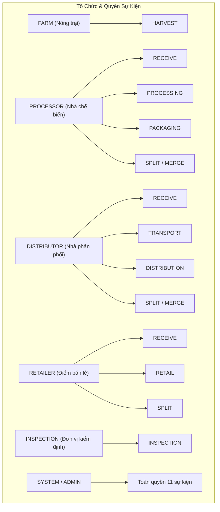
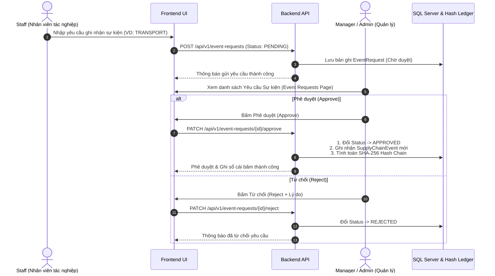

# 🔗 Tài Liệu Nghiệp Vụ Sự Kiện Chuỗi Cung Ứng & Yêu Cầu Sự Kiện (Supply Chain Event & Event Requests Specification)

> **Hệ thống Truy xuất Nguồn gốc Nông sản AgriTrace**  
> **Phiên bản:** 1.2  
> **Cập nhật gần nhất:** 03/08/2026  

---

## 📋 1. Tổng Quan Về Sự Kiện Chuỗi Cung Ứng (Supply Chain Event Overview)

Trong hệ thống **AgriTrace**, **Sự kiện chuỗi cung ứng (Supply Chain Event)** đại diện cho một mốc lịch sử tác nghiệp thực tế diễn ra đối với một Lô hàng nông sản (`Batch`).

Mỗi sự kiện là một bản ghi bằng chứng不可竄改 (Immutability), tuân thủ nghiêm ngặt nguyên tắc **Append-Only Ledger** (Chỉ được thêm mới, tuyệt đối không được phép sửa đổi hoặc xóa bỏ). Dữ liệu này giúp hình thành Dòng thời gian (Timeline) truy xuất nguồn gốc minh bạch từ trang trại đến bàn ăn.

---

## 🏷️ 2. Danh Sách 11 Loại Sự Kiện (Event Types)

Hệ thống định nghĩa 11 loại sự kiện tiêu chuẩn tương ứng với các giai đoạn tác nghiệp trong chuỗi cung ứng nông sản:

| Mã Sự Kiện | Tên Sự Kiện | Tác Vụ Nghiệp Vụ Chi Tiết |
| :--- | :--- | :--- |
| **`HARVEST`** | Thu hoạch | Ghi nhận thời điểm, số lượng và tọa độ nông trại thu hoạch nông sản thô. |
| **`RECEIVE`** | Tiếp nhận | Cơ sở chế biến hoặc kho phân phối tiếp nhận lô hàng từ mắt xích trước. |
| **`PROCESSING`** | Chế biến | Thực hiện sơ chế, phân loại, bảo quản hoặc chế biến sâu nông sản. |
| **`PACKAGING`** | Đóng gói | Đóng gói thành phẩm, dán tem nhãn QR code. |
| **`TRANSPORT`** | Vận chuyển | Ghi nhận quá trình vận tải, phương tiện, nhiệt độ bảo quản và hành trình. |
| **`DISTRIBUTION`** | Phân phối | Xuất kho phân phối đến các trung tâm thương mại / siêu thị. |
| **`RETAIL`** | Bán lẻ | Lô hàng sẵn sàng đưa lên kệ siêu thị / điểm bán lẻ tới người tiêu dùng. |
| **`INSPECTION`** | Kiểm định | Đơn vị kiểm định độc lập kiểm tra chỉ tiêu an toàn/chất lượng và kết luận. |
| **`RECALL`** | Thu hồi | Cảnh báo vi phạm chất lượng và khoanh vùng thu hồi lô hàng. |
| **`SPLIT`** | Tách lô | Tách một lô lớn thành nhiều lô nhỏ hơn. |
| **`MERGE`** | Gộp lô | Gộp nhiều lô nguyên liệu nguồn thành một lô thành phẩm lớn. |

---

## 📑 3. Ma Trận Phân Quyền Sự Kiện Theo Loại Tổ Chức (Organization Event Permissions)

Để đảm bảo tính đúng đắn nghiệp vụ, mỗi loại Tổ chức (`OrganizationType`) chỉ được phép ghi nhận các loại sự kiện thuộc phạm vi chức năng của mình:

### Bảng Ma Trận Phân Quyền Chi Tiết:

| Loại Tổ Chức (`OrgType`) | Các Sự Kiện Được Phép Tạo / Đăng Ký Yêu Cầu |
| :--- | :--- |
| **`FARM`** (Nông trại) | `HARVEST` |
| **`PROCESSOR`** (Nhà chế biến) | `RECEIVE`, `PROCESSING`, `PACKAGING`, `SPLIT`, `MERGE` |
| **`DISTRIBUTOR`** (Nhà phân phối) | `RECEIVE`, `TRANSPORT`, `DISTRIBUTION`, `SPLIT`, `MERGE` |
| **`RETAILER`** (Điểm bán lẻ) | `RECEIVE`, `RETAIL`, `SPLIT` |
| **`INSPECTION`** (Đơn vị kiểm định) | `INSPECTION` |
| **`SYSTEM` / `ADMIN`** | Tất cả 11 loại sự kiện (`HARVEST`, `RECEIVE`, `PROCESSING`, `PACKAGING`, `TRANSPORT`, `DISTRIBUTION`, `RETAIL`, `INSPECTION`, `RECALL`, `SPLIT`, `MERGE`) |

---

## 🔄 4. Quy Trình Yêu Cầu Sự Kiện (Event Request Workflow)

Để ngăn chặn nhân viên tự ý ghi nhận sự kiện sai lệch vào sổ cái băm, hệ thống áp dụng **Quy trình Phê duyệt Sự kiện (Event Request Workflow)**:

### Chi tiết trạng thái Yêu cầu Sự kiện (`EventRequestStatus`):
1. **`PENDING` (Chờ phê duyệt):** Yêu cầu vừa được khởi tạo bởi Nhân viên.
2. **`APPROVED` (Đã phê duyệt):** Quản lý chấp thuận, hệ thống tự động ghi nhận sự kiện chính thức vào chuỗi băm Sổ cái.
3. **`REJECTED` (Đã từ chối):** Yêu cầu bị hủy bỏ do sai lệch thông tin.

---

## 🔐 5. Cơ Chế Chuỗi Băm Cryptographic Hash Chain (SHA-256)

Để đảm bảo dữ liệu lịch sử không thể bị chỉnh sửa trực tiếp trong CSDL (Anti-Tampering):

### 5.1 Công thức tính mã băm (Hash Calculation Formula)

Mỗi sự kiện khi tạo ra sẽ tính toán 2 trường hash mã hóa:
- **`PreviousHash`**: Lấy mã `CurrentHash` của sự kiện liền trước thuộc cùng Lô hàng (`BatchId`). Nếu là sự kiện đầu tiên (`HARVEST`), `PreviousHash` mặc định là `64 số 0`.
- **`CurrentHash`**: Được tính bằng thuật toán **SHA-256** trên toàn bộ chuỗi thông tin sự kiện:

$$\text{CurrentHash} = \text{SHA256}(\text{PreviousHash} + \text{BatchId} + \text{EventType} + \text{EventData} + \text{Location} + \text{UserId} + \text{Timestamp})$$

### 5.2 Kiểm tra tính Toàn vẹn Dữ liệu (Integrity Verification)
- Endpoint `GET /api/v1/batches/{id}/events/verify` thực hiện quét lại từ sự kiện đầu tiên đến sự kiện cuối cùng.
- Nếu phát hiện bất kỳ sự kiện nào có `CurrentHash` không khớp với công thức băm hoặc `PreviousHash` bị đứt gãy, hệ thống lập tức cảnh báo vi phạm tính toàn vẹn.

---

## 🏛️ 6. Thuộc Tính Thực Thể Sự Kiện (`SupplyChainEvent`)

| Thuộc tính | Kiểu dữ liệu | Mô tả |
| :--- | :--- | :--- |
| **`Id`** | `Guid` | Mã định danh duy nhất của sự kiện. |
| **`BatchId`** | `Guid` | Tham chiếu tới Lô hàng tác động. |
| **`EventTypeId` / `EventType`** | `Guid` / `String` | Loại sự kiện (1 trong 11 loại). |
| **`OrganizationId`** | `Guid` | Tổ chức thực hiện tác nghiệp. |
| **`PerformedByUserId`** | `Guid` | Người dùng (Nhân viên/Quản lý) thực hiện tác nghiệp. |
| **`EventTime`** | `DateTime` | Thời điểm ghi nhận sự kiện. |
| **`Location`** | `String` | Địa chỉ nơi diễn ra sự kiện (Hỗ trợ tìm kiếm/chọn trên Bản đồ `MapPickerModal`). |
| **`GpsLocation`** | `String` | Tọa độ GPS địa lý (`vĩ độ, kinh độ`). |
| **`EventData`** | `String` | Ghi chú/Chi tiết dữ liệu tác nghiệp (nhiệt độ, phương tiện, độ ẩm...). |
| **`PreviousHash`** | `String` | Mã băm của sự kiện trước đó (64 ký tự hex). |
| **`CurrentHash`** | `String` | Mã băm của sự kiện hiện tại (64 ký tự hex). |

---

## 🚀 7. Tóm Tắt Tương Tác Nghiệp Vụ

1. **Staff** thuộc Nông trại/Cơ sở chế biến/Kho/Siêu thị thực hiện tác nghiệp thực tế ➔ Mở giao diện **Event Requests** ➔ Nhập thông tin & Chọn vị trí bản đồ ➔ Gửi yêu cầu `PENDING`.
2. **Manager / Admin** mở danh sách Yêu cầu Sự kiện ➔ Rà soát thông tin ➔ Bấm **Approve**.
3. **Hệ thống Backend** tiếp nhận lệnh duyệt ➔ Tính toán chuỗi băm SHA-256 ➔ Lưu bản ghi `SupplyChainEvent` Append-Only.
4. **Người tiêu dùng (Consumer)** khi quét mã QR Code trên sản phẩm sẽ thấy toàn bộ dòng thời gian các Sự kiện đã được xác thực (Green Verified Badge).

---
*Tài liệu này được biên soạn cho dự án AgriTrace tuân thủ Clean Architecture và kiến trúc sổ cái mã hóa SHA-256.*
